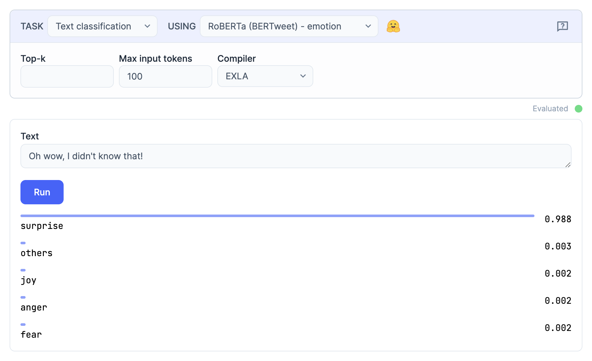

# KinoBumblebee

[](https://hexdocs.pm/kino_bumblebee)
[](https://github.com/livebook-dev/kino_bumblebee/actions)

[Bumblebee](https://github.com/elixir-nx/bumblebee) integration for [Livebook](https://livebook.dev).

This ships by default as part of Livebook v0.8.0. Simply [install Livebook](https://livebook.dev/#install),
open up a new notebook, and choose the "Neural Networks task" under the "+ Smart" cell prompt.

## Installation

To bring KinoBumblebee to Livebook all you need to do is `Mix.install/2`:

```elixir
Mix.install([
  {:kino_bumblebee, "~> 0.2.1"}
])
```

## Examples

After installing this package in Livebook you can interactively experiment
with a number of Machine-Learning tasks, using different pre-trained models.
A couple examples of what's possible:

### Text-to-image


### Image classification


### Text classification



### Token classification


### Zero-shot text classification


### Fill-mask


### Question answering


### Text generation


### Speech-to-text


### Conversation


## License

Copyright (C) 2022 Dashbit

Licensed under the Apache License, Version 2.0 (the "License");
you may not use this file except in compliance with the License.
You may obtain a copy of the License at [http://www.apache.org/licenses/LICENSE-2.0](http://www.apache.org/licenses/LICENSE-2.0)

Unless required by applicable law or agreed to in writing, software
distributed under the License is distributed on an "AS IS" BASIS,
WITHOUT WARRANTIES OR CONDITIONS OF ANY KIND, either express or implied.
See the License for the specific language governing permissions and
limitations under the License.
